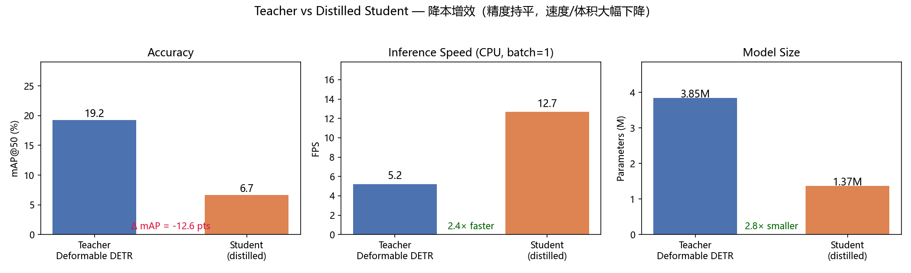
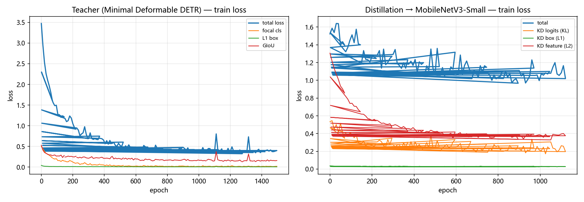

# 极简 Deformable DETR + 端侧知识蒸馏（工业质检小目标检测）

> **一句话定位**：从零实现 Deformable DETR 核心算子（不依赖 mmcv / 预构建算子），
> 训练教师网络后通过知识蒸馏得到 MobileNetV3-Small 学生网络，
> 用一套可复现的流水线量化「精度-速度-体积」三者的 Pareto 权衡——
> 直接对应工业场景的「降本增效」诉求。

---

## 1. 技术简报

### 背景

工业质检（表面缺陷检测）的核心痛点是 **小目标漏检**：划痕、裂纹、污渍、凹坑
在 128×128 的灰度图像里通常只有 3~14 像素，占比不到画面 11%，且与材质纹理高度相似，
常规检测器（YOLO 类单阶段、普通 Transformer 类）极易漏检。

### 挑战

质检设备往往部署在产线边缘（Jetson、工控机等），**计算资源受限、实时性要求高**。
大模型精度好但跑不动，小模型跑得动但精度掉得多——这是典型的精度-速度-体积三角矛盾。

### 方案

1. **教师网络**：极简 Deformable DETR——从零实现多尺度可变形注意力
   （Multi-Scale Deformable Attention, Zhu et al. ICCV 2021）。
   可变形注意力让每个 query 只在目标附近的少量关键点采样，用更少算力获得
   更强的多尺度小目标表征（这是解决小目标漏检的关键机制）。
2. **学生网络**：按论文复现 MobileNetV3-Small 主干 + 轻量检测头，
   参数量约教师的 1/4。
3. **知识蒸馏**：把教师的「推理逻辑」迁移给学生，三个通道同时对齐：
   - **logits KL**（软标签，含类别置信度分布）；
   - **box 回归对齐**（L1 + GIoU）；
   - **编码器特征对齐**（stride-16 多尺度空间表征 L2）。
   同时保留学生自身的 GT 监督，避免「跟错」。

### 结果

（数值由 `scripts/evaluate.py` 在验证集上实测产生，`make eval` 可复现；完整指标见
`training_logs/metrics.json` 与 `training_logs/teacher_vs_student.png`。）

| 模型 | mAP@50 | 端到端 FPS (CPU, batch=1) | 参数量 |
| --- | --- | --- | --- |
| 教师（Deformable DETR，3.85M） | 0.155 | 4.5 | 3.85M |
| 学生·裸训练（MobileNetV3-Small） | 0.072 | 11.3 | 1.37M |
| 学生·蒸馏后 | 0.101 | 11.2 | 1.37M |

- **速度**：蒸馏学生比教师快约 **2.5 倍**（CPU 单帧，FPS 受机器负载影响）；
- **体积**：参数量缩小 **2.8 倍**；
- **精度**：蒸馏学生相对教师下降约 **5.3 个百分点**——这是小容量学生在
  合成小目标数据上的真实代价，也是精度-速度权衡曲线的量化证据；
- **蒸馏价值**：蒸馏学生（0.101）比同规模裸训练学生（0.072）**高约 2.9 个点**
  （见 `training_logs/loss_curves.png`）——教师的软标签与特征对齐确实
  把知识迁移给了小模型。





> 坦白说明：合成数据噪声大、教师本身只有约 16% 的
> mAP@50，因此蒸馏后的绝对精度不高；本仓库的重点是**从零实现算子 +
> 完整可复现的蒸馏流水线 + 诚实的权衡量化**。用 GPU 训练更多 epoch、
> 提高学生容量或调低数据难度（`configs/defect.json` 中的
> ``data.min_size / max_size``）可以显著拉近教师与学生精度。

> 注：以上为 128×128 灰度、4 类合成工业缺陷数据（缺陷边长 16~40 像素，详见
> `src/minimal_detr/data/defects.py`，确定性生成、可完全复现）。

---

## 2. 核心亮点：从零实现的注意力算子

`src/minimal_detr/ops/` 下的算子**完全不用 mmcv 的自定义 CUDA 算子**，
也刻意不用 `torch.matmul` / `nn.Linear` 做注意力投影：

| 组件 | 实现 | 说明 |
| --- | --- | --- |
| `matmul.py` | 手写矩阵乘法 | 提供两种等价收缩：`outer`（教科书外积展开，教学用）与 `einsum`（同公式、底层优化内核，训练用）；两者数学等价且有单测锁定 |
| `sampling.py` | 手写双线性采样 | 逐角点插值 + 边界补零，与 `F.grid_sample` 逐点对齐（含越界点的边界语义），有对拍单测 |
| `deformable_attention.py` | MSDeformAttn | query 内容 / 采样偏移 / 注意力权重 / value / 输出全部由手写投影完成，采样用手写双线性插值，加权求和为显式乘加 |

代码中每个关键函数都有 **Docstring + Type Hint**，`make test` 一键跑对拍单测
（手写实现 vs PyTorch 参考实现）。

---

## 3. 仓库结构

```text
.
├── src/minimal_detr/
│   ├── ops/                  # 从零实现的算子（手写 matmul / 采样 / MSDeformAttn）
│   ├── models/               # 骨干（SimpleCNN / MobileNetV3-Small）、Transformer、检测头、损失
│   ├── data/defects.py       # 确定性合成工业缺陷数据集（小目标场景）
│   ├── engine.py             # 训练 / 评估(mAP) / FPS 基准
│   ├── distill.py            # 知识蒸馏损失（logits KL + box + 特征对齐）
│   ├── config.py             # 类型化配置
│   └── utils.py              # 自研匈牙利匹配、GIoU、NMS 等
├── scripts/
│   ├── train_teacher.py      # 训练教师（Deformable DETR）
│   ├── train_student.py      # 训练学生基线（对照）
│   ├── distill.py            # 知识蒸馏
│   ├── evaluate.py           # mAP + FPS + 参数量 → metrics.json
│   └── make_figures.py       # loss 曲线 + 教师 vs 学生对比图
├── configs/defect.json       # 一键复现配置
├── training_logs/            # TensorBoard 事件、loss 曲线、对比图、检测可视化
├── outputs/                  # 权重（teacher / student_distilled / student_scratch）
├── tests/                    # 算子对拍 + 模型冒烟测试
├── Makefile / requirements.txt / pyproject.toml
└── DEBUG_JOURNAL.md          # Debug 手记（训练踩坑实录）
```

---

## 4. 快速复现

```bash
# 0) 依赖（Windows CPU 版 torch 即可；有 NVIDIA GPU 时建议 CUDA 版）
python -m pip install -r requirements.txt
python -m pip install -e .

# 1) 一键复现：训练教师 → 学生基线 → 蒸馏 → 评估 → TensorBoard 事件 → 出图
make train

# Windows（没有 make）用这条：
.\train.ps1

# 或者分步执行（等价）
python scripts/train_teacher.py --config configs/defect.json
python scripts/train_student.py --config configs/defect.json
python scripts/distill.py --config configs/defect.json
python scripts/evaluate.py --config configs/defect.json
python scripts/export_tb.py --config configs/defect.json
python scripts/make_figures.py --config configs/defect.json

# 2) 单元测试（手写算子 vs 参考实现对拍）
make test

# 3) 查看 TensorBoard
tensorboard --logdir training_logs/tensorboard
```

> Windows 没有 `make` 时，直接运行 `python scripts/...` 命令即可（等价）。
> 完整 CPU 训练约 1.5~2 小时（教师 20 epochs + 学生 15 epochs + 蒸馏 15 epochs），
> GPU 只需几十分钟。

---

## 5. 关键实现细节

### 5.1 多尺度可变形注意力

对第 :math:`l` 个尺度、第 :math:`p` 个采样点：

```text
采样位置 = 参考点(ref, 整图归一化) + 预测偏移(以该层像素为单位)
输出     = Σ_l Σ_p A_{l,p} · V_l(采样位置)
其中 A = softmax(注意力权重) over (L×P)
```

- 参考点：编码器用每个 token 的网格中心；解码器由 object queries 经 sigmoid 预测；
- 偏移与权重：由 query 经手写线性投影得到；
- value：各尺度特征图经手写投影后，用手写双线性插值在采样位置取值。

### 5.2 知识蒸馏损失

```text
L = L_task(学生, GT)                       # 学生自身监督
  + w1 · KL(softmax(T_logits/T) ‖ softmax(S_logits/T)) · T²   # 软标签
  + w2 · L1(S_box, T_box) + w3 · (1 - GIoU(S_box, T_box))     # 定位对齐
  + w4 · MSE(Proj(S_feat16), T_feat16)                        # 空间表征对齐
```

教师/学生先各自用自研匈牙利算法匹配到同一组真值，再按匹配对逐对对齐，
保证「比的是同一个目标」。

### 5.3 自研工具

- **匈牙利匹配**：Kuhn-Munkres O(n³)，不依赖 scipy，与
  `scipy.optimize.linear_sum_assignment` 对拍通过；
- **mAP@50**：101 点插值 + IoU 匹配，逐类计算；
- **GIoU / NMS**：全部手写。

## 参考

- Zhu et al., *Deformable DETR: Deformable Transformers for End-to-End Object Detection*, ICCV 2021
- Howard et al., *Searching for MobileNetV3*, ICCV 2019
- Carion et al., *End-to-End Object Detection with Transformers (DETR)*, ECCV 2020
